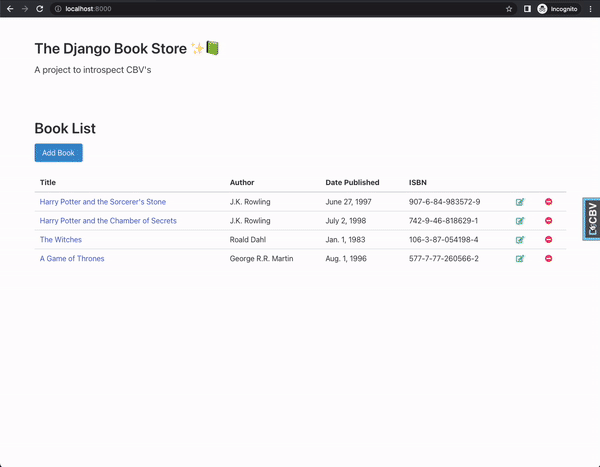

# Django CBV Inspect
A tool to inspect all class-based views within your Django project.



## Installation
1. Install with pip
```
pip install django-cbv-inspect
```

2. Add `cbv_inspect` to your list of `INSTALLED_APPS` in your Django settings module
```python
INSTALLED_APPS = [
    ...
    "cbv_inspect",
    ...
]
```

3. Add the middleware to your list of `MIDDLEWARE` classes in your Django settings module
```python
MIDDLEWARE = [
    ...
    "cbv_inspect.middleware.DjCbvInspectMiddleware",
    ...
]
```

4. **Prerequisite:** In your `TEMPLATES` settings within your Django settings module, make sure
   1. the `BACKEND` setting is `""django.template.backends.django.DjangoTemplates""`
   2. the `APP_DIRS` setting is `True`


## Usage
When all installation steps are done, then any html response rendered by a class-based view should display the `django-cbv-inspect` toolbar on the page.

By default, all class-based views will be processed by the middleware. If you wish to exclude views, there are two options:

### Exclude via mixin
```python
from cbv_inspect.mixins import DjCbvExcludeMixin


class MyCoolView(DjCbvExcludeMixin, View):
    pass
```


### Exclude via decorator
```python
from django.utils.decorators import method_decorator

from cbv_inspect.decorators import djcbv_exclude


@method_decorator(djcbv_exclude, name="dispatch")
class MyCoolView(View):
    pass
```

## Test locally
You can clone and run the `example` project for local development. 

From the root of the repo, run the following Make command to setup the `example` project:
```
make run-example
```

To run unittests with coverage, use the following Make command
```
make coverage
```